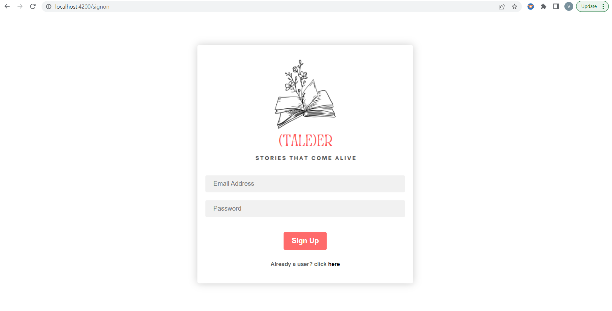
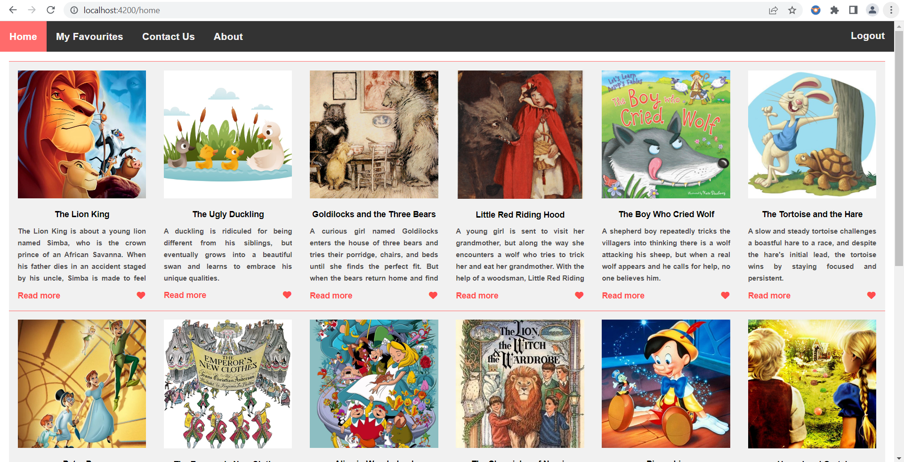
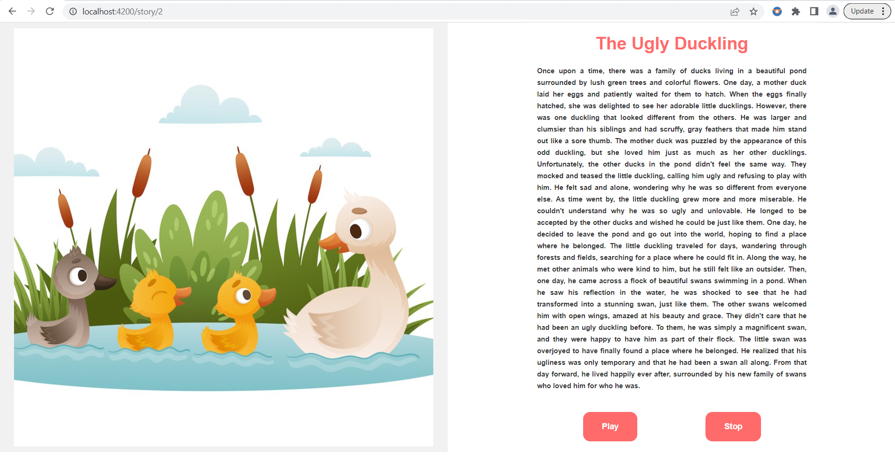
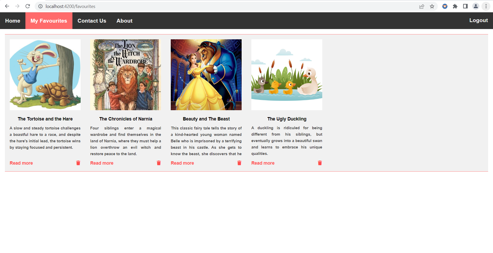
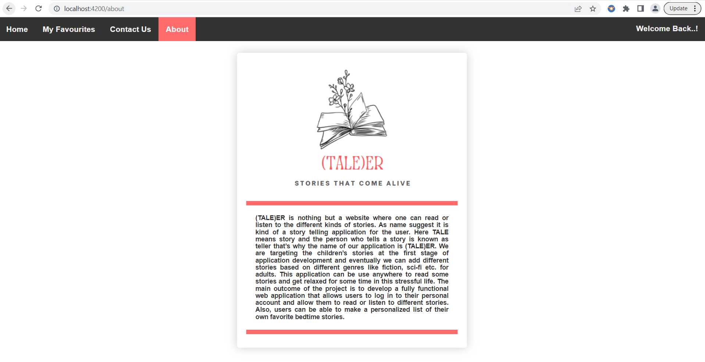

# (TALE)ER
(TALE)ER is a web application that offers users the ability to read or listen to different kinds of stories. The project’s primary focus is to create a user-friendly interface that enables users to login to their personal account, read stories, and save their favorite bedtime stories for future reference. 

# Sign-up Page

# Home Page

# Story Page

# Favourites Page

# About Page

